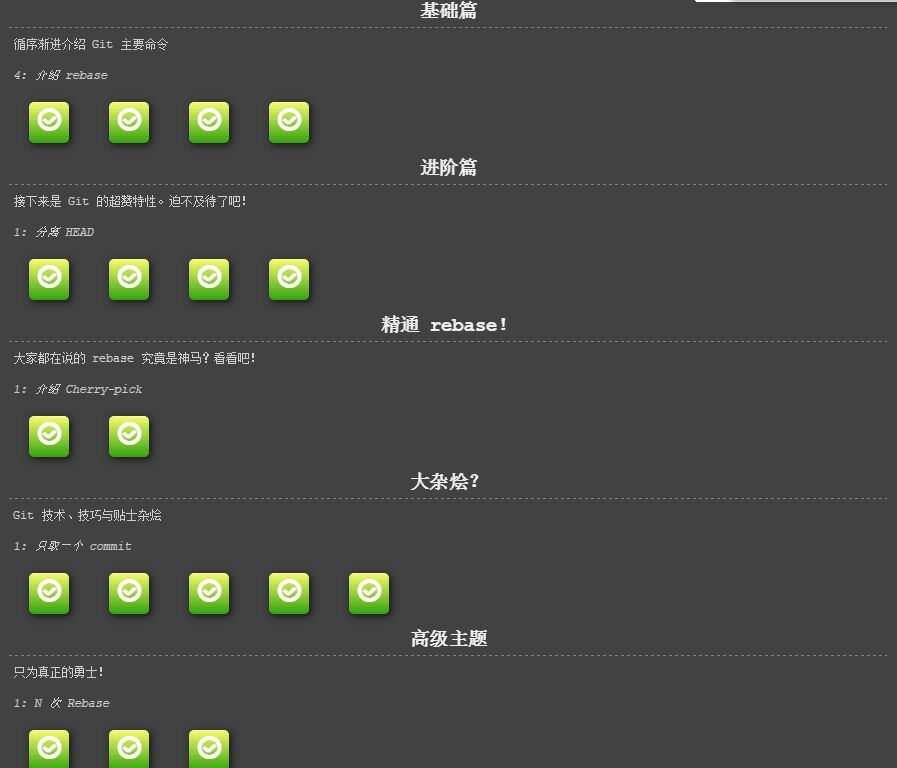
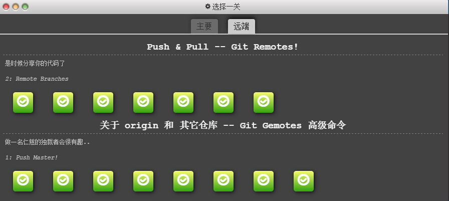
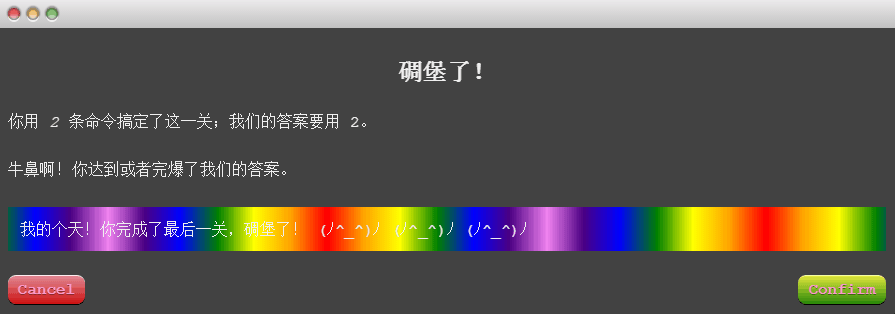

#1.玩git游戏并截图
 

#2.发布一个npm包到服务器上并贴出npmjs官网网址
[https://www.npmjs.com/package/nodestudy_crystal](https://www.npmjs.com/package/nodestudy_crystal)

#3.实现一个Buffer.concat方法
    
    /**
     * crud.js
     * 1. list 一个由Buffer组成的数组
     * 2. 最后返回的Buffer的长度
     * Buffer.concat(list[,totalLength]);
     */
    function concat(list,length){
    if(!Array.isArray(list)){
        throw new TypeError("The list argument must be an Array.")
    }

    if(length === undefined){
        length = 0;
        for(var i = 0; i < list.length; i++){
            length += list[i].length;
        }
    }

    var buffer = new Buffer(length);
    var pos = 0;
    for(var i = 0; i < list.length; i++){
        //复制Buffer： Buffer.copy(targetBuffer,targetStart,sourceStart,sourceEnd);
        list[i].copy(buffer, pos);
        pos += list[i].length;
    }

    return buffer;
    }

    var buf1 = new Buffer("珠");
    var buf2 = new Buffer("峰");
    var result = concat([buf1,buf2]);
    
    console.log(result.toString());//珠峰

#4.实现一个ajax增加和查询的功能。

    /**
     * Created by crystal on 3/9/16.
     * 功能：
     * 查询 把后台存放的用户数组查出来放在table里
     * 增加 把用户填写的表单添加到后台
     * 删除
     * 修改
     */
    var http = require('http');
    var fs= require('fs');
    var mime = require('mime');
    var path = require('path');
    var url = require('url');
    
    var users = [];
    
    var server = http.createServer(function(request,response){
        //把url转成url对象
        var urlObj = url.parse(request.url,true);
        var pathname = urlObj.pathname;
    
        if(pathname == '/'){
            pathname = '/list.html';
        }
    
        if(pathname == '/favicon.ico'){
            response.end('404');
        }
    
        if(pathname == '/'){
            response.writeHead(200, {'Content-Type':'text/html;charset=utf-8'});
            fs.readFile('./list.html', function(err, data){
                response.end(data);
            })
        }else if(pathname == '/list') {
            fs.readFile('./user.json', function (err, data){
                if(!err){
                    var result = data.toString() == '' ? '[]' : data.toString();
                    response.end('{"status":"success", "value":' + result + '}');
                }else{
                    response.end('Query failed!')
                }
            });
    
        }else if(pathname == '/add'){
            //每当服务器收到客户端发过来的一段数据的时候就会触发data事件
            var str = '';
            var obj = {};
            request.on('data', function(data){
                str += data.toString();
                obj = JSON.parse(str);
            });
    
            request.on('end', function(){
                fs.readFile('./user.json', function(err,data){
    
                    if (data.toString() != '') {
                        users = JSON.parse(data);
                    }
    
                    if (users.length == 0) {
                        obj.id = 1;
                    } else {
                        obj.id = users[users.length - 1].id + 1;
                    }
                    users.push(obj);
                    response.end('{"status":"success", "value":' + str + '}');
    
                    fs.writeFile('./user.json',JSON.stringify(users),[{encoding:'utf-8'},{flag:'a'}], function(err){
                        if(err){
                            response.end('{"status":"error"}');
                        }else{
                            response.end('{"status":"success"}');
                        }
                    })
                })
            });
        }else if(pathname == '/edit'){
            var str = '';
            var strObj = {};
            request.on('data', function(data){
                str = data.toString();
            })
            request.on('end', function(){
                fs.readFile('./user.json', function(err, data){
                    if(!err){
                        strObj = JSON.parse(str);
                        strObj.id = parseInt(strObj.id);
                        if (data.toString() != '') {
                            users = JSON.parse(data);
                        }
                        for(var i =0 ; i < users.length; i++){
                            if(users[i].id == strObj.id){
                                users[i] = strObj;
                            }
    
                        }
                        response.end('{"status":"success", "value":' + JSON.stringify(users) + '}');
                    }
                    fs.writeFile('./user.json',JSON.stringify(users),'utf8', function(err){
                        if(err){
                            response.end('{"status":"error"}');
                        }else{
                            response.end('{"status":"success"}');
                        }
                    })
                })
            })
        }else if(pathname == '/remove'){
            var idstr = '';
            request.on('data', function(data){
                idstr = data.toString();
            });
    
            request.on('end', function(){
                fs.readFile('./user.json', function(err, data){
                    if(!err){
                        fs.readFile('./user.json', function(err,data){
                            if(!err){
                                if (data.toString() != '') {
                                    users = JSON.parse(data);
                                }
                                for(var i=0; i<users.length; i++){
                                    if(users[i].id == idstr){
                                        users.splice(i,1);
                                    }
                                }
                                response.end('{"status":"success", "value":' + JSON.stringify(users) + '}');
                            }
                            fs.writeFile('./user.json',JSON.stringify(users),'utf8', function(err){
                                if(err){
                                    response.end('{"status":"error"}');
                                }else{
                                    response.end('{"status":"success"}');
                                }
                            })
    
                        })
    
                    }
                })
            })
        }else{
            fs.exists('.'+pathname, function(exists){
                if(exists){
                    fs.readFile('.'+pathname,function(err,data){
                        //如果读取文件出错了，则也报404错误
                        if(err){
                            response.end();
                        }else{
                            response.write(data);
                            response.end();
                        }
    
                    })
                }else{
                    response.end();
                }
            });
        }
    
    
    
    });
    
    server.listen(3000, 'localhost');
    
    
    /**
    * list.html
    */
    <!DOCTYPE html>
    <html lang="en">
    <head>
        <meta charset="UTF-8">
        <title>List</title>
        <link rel="stylesheet" href="bootstrap.min.css"/>
    </head>
    <body style="width:80%; margin: 0 auto;">
    

        <h2 class="form-title">Add user</h2>
        

            <label for="Username" >Username</label>
            <input type="text" class="form-control" name="username" placeholder="Please input your name"/>
        

        

            <label for="Age" >Age</label>
            <input type="text" class="form-control" name="age" placeholder="Please input your age"/>
        

         <button type="submit" class="btn btn-primary" id="add">Add</button>
        

    

    

        

            <h2>List all users</h2>
            <table class="table table-hover">
                <tr>
                    <th>Name</th>
                    <th>Age</th>
                    <th>Operations</th>
                </tr>
    
            </table>
        

    

    </body>
    </html>
    
    
    
    
    
    /**
    * users.json
    */
    [{"username":"crystal","age":"23","id":1},{"username":"Linda","age":"25","id":3},{"username":"charper","age":"20","id":4},{"username":"admin","age":"123","id":5}]
